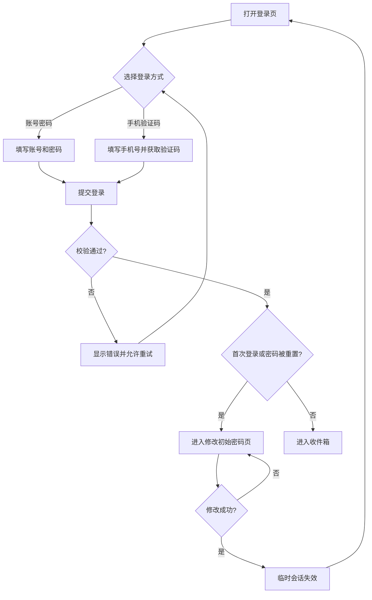
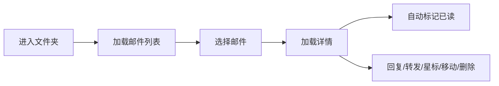
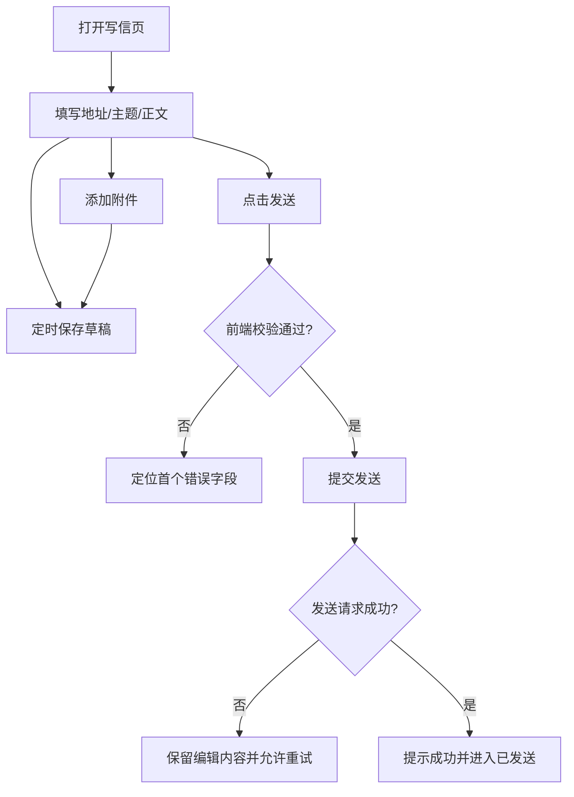

# 企业邮箱客户端 Web 端前端原型开发文档

> 文档版本：v1.0  
> 编制日期：2026-08-19  
> 文档状态：原型开发基线  
> 来源：[Gemini 共享需求对话](https://share.gemini.google/AY2rGJV7vpyj)  
> 适用对象：产品经理、UI/UX、前端开发、前端测试

## 1. 文档说明

### 1.1 目的

本文将共享对话中的企业邮箱 Web 端需求整理为可执行的前端原型开发基线，统一页面范围、路由、组件、交互状态、Mock 数据和前端验收口径。

### 1.2 需求标记

| 标记 | 含义 |
| --- | --- |
| 已确认 | 共享需求中明确出现，可直接进入原型 |
| 默认方案 | 为保证原型闭环补齐的建议实现，可在评审时调整 |
| 待确认 | 会影响前端交互或开发成本，需要产品、设计或前端确认 |

### 1.3 产品定位

- 产品名称：企业邮箱客户端 Web 端（Mail Web Client）。
- 目标终端：桌面浏览器。
- 目标用户：企业员工及日常办公邮件使用者。
- 核心价值：完成邮件登录、查阅、撰写、回复、转发、分类和个人设置等日常工作。
- 基准分辨率：1920 × 1080。
- 最小适配分辨率：1280 × 720。

### 1.4 原型交付边界

原型需要完整演示页面跳转、关键操作、加载/空/错误状态和数据联动，业务数据统一由前端 Mock 提供。本文只描述前端页面、路由、组件、状态和验收。

## 2. 范围与优先级

### 2.1 功能范围

| 优先级 | 模块 | 原型目标 |
| --- | --- | --- |
| P0 | 登录 | 账号密码登录、手机号验证码登录、异常提示 |
| P0 | 首次登录 | 强制修改初始密码并回到登录流程 |
| P0 | 全局框架 | 左侧导航、顶部搜索、用户区、未读数 |
| P0 | 收件箱 | 邮件列表、详情、已读/未读、星标、删除、移动 |
| P0 | 写信 | 收件人、抄送、密送、主题、正文、附件、草稿、发送 |
| P0 | 回复/全部回复/转发 | 地址和主题预填、原文引用、附件继承规则 |
| P0 | 系统邮箱 | 星标、草稿、已发送、已删除、垃圾邮件 |
| P1 | 批量管理 | 批量已读/未读、删除、移动、标记垃圾邮件 |
| P1 | 搜索 | 关键字搜索与高级筛选 |
| P1 | 我的文件夹 | 新建、重命名、排序、删除、邮件归类 |
| P1 | 邮件设置 | 个人资料、签名、自动回复、黑白名单、收信规则 |
| P1 | 附件能力 | 上传进度、失败重试、预览、下载 |
| P2 | 增强展示 | 大附件状态、投递状态、实时消息、身份切换的前端演示 |

### 2.2 本期不默认包含

- 移动端或平板端专用布局。
- 日历、会议、任务、云盘、即时通信。
- 邮箱管理员后台。
- 真实 SPF/DKIM 验签实现，仅预留状态展示。
- 复杂组织权限、邮件审批、邮件归档审计。
- 端到端加密、S/MIME、PGP。
- 多租户品牌定制。

## 3. 角色与权限

| 角色 | 能力 |
| --- | --- |
| 未登录用户 | 登录、获取验证码、查看登录异常 |
| 首次登录用户 | 仅允许修改初始密码和退出 |
| 普通邮箱用户 | 使用邮件、文件夹、搜索和个人设置功能 |
| 受限用户 | 根据 Mock 权限隐藏或禁用发送、下载、外发等能力 |

前端原型只根据 Mock 权限字段演示不同界面状态。

## 4. 信息架构

```text
企业邮箱 Web
├── 登录
│   ├── 账号密码登录
│   ├── 手机验证码登录
│   └── 首次登录修改密码
├── 邮件工作台
│   ├── 收件箱
│   ├── 星标邮件
│   ├── 草稿箱
│   ├── 已发送
│   ├── 已删除
│   ├── 垃圾邮件
│   └── 我的文件夹
├── 邮件编辑
│   ├── 新建邮件
│   ├── 回复
│   ├── 全部回复
│   └── 转发
└── 邮件设置
    ├── 个人资料
    ├── 邮件签名
    ├── 自动回复
    ├── 收信规则
    └── 黑白名单
```

## 5. 建议路由

> 路由为默认方案，可按现有工程规范调整。

| 路由 | 页面 | 访问条件 |
| --- | --- | --- |
| `/login` | 登录 | 匿名 |
| `/first-login/reset-password` | 修改初始密码 | 临时会话 |
| `/mail/inbox` | 收件箱 | 已登录 |
| `/mail/starred` | 星标邮件 | 已登录 |
| `/mail/drafts` | 草稿箱 | 已登录 |
| `/mail/sent` | 已发送 | 已登录 |
| `/mail/trash` | 已删除 | 已登录 |
| `/mail/spam` | 垃圾邮件 | 已登录 |
| `/mail/folder/:folderId` | 自定义文件夹 | 已登录 |
| `/mail/search` | 搜索结果 | 已登录 |
| `/compose` | 新建邮件 | 已登录且可发信 |
| `/compose/:draftId` | 编辑草稿 | 已登录且可发信 |
| `/settings/profile` | 个人资料 | 已登录 |
| `/settings/signatures` | 邮件签名 | 已登录 |
| `/settings/auto-reply` | 自动回复 | 已登录 |
| `/settings/rules` | 收信规则 | 已登录 |
| `/settings/blocklist` | 黑白名单 | 已登录 |

## 6. 全局页面框架

### 6.1 桌面布局

登录后的默认工作台采用三栏结构：

1. 左侧导航栏：写信入口、系统邮箱、自定义文件夹、设置入口。
2. 中间邮件列表：筛选、批量操作和邮件摘要。
3. 右侧详情区：邮件头、正文、附件和快捷操作。

默认尺寸建议：导航栏 220px，列表栏 360～420px，详情区占据剩余空间。1280px 宽度下允许折叠导航栏，详情区不得小于 560px。

### 6.2 顶部区域

- 全局搜索框。
- 高级搜索入口。
- 刷新入口。
- 用户头像、昵称、邮箱地址。
- 邮箱容量使用情况。
- 个人设置和退出登录。

### 6.3 全局反馈

| 场景 | 反馈方式 |
| --- | --- |
| 表单校验 | 字段下方就地提示 |
| 普通成功 | 顶部轻提示，自动消失 |
| 可恢复失败 | 错误提示 + 重试按钮 |
| 危险操作 | 二次确认对话框 |
| 长任务 | 进度条或持续状态提示 |
| 无网络 | 顶部常驻离线提示 |

## 7. 核心业务流程

### 7.1 登录与首次登录



业务规则：

- 账号密码登录支持完整邮箱地址或企业用户名。
- 手机验证码登录仅支持已绑定的安全手机号。
- 账号或密码错误统一提示“账号或密码错误”，避免暴露账号是否存在。
- 验证码错误、失效、发送过频可使用不同提示。
- 防暴力破解、账号锁定和图形验证码展示由 Mock 场景驱动。
- 首次登录用户不能绕过改密页进入工作台。
- 修改初始密码成功后默认要求重新登录。

### 7.2 查看邮件



- 自动已读时机默认为详情成功展示后。
- 列表和详情的已读、星标、文件夹状态应同步。
- 打开下一封邮件失败时保留当前列表和选择状态。

### 7.3 写信与发送



- 至少有一个有效收件人才能发送。
- 主题为空时二次确认，正文为空可发送。
- 上传中的附件会阻止发送并提示等待或移除。
- 防止连续点击造成重复发送。
- 发送成功后删除对应草稿。

### 7.4 删除与恢复

- 普通文件夹删除：软删除并进入已删除。
- 已删除内删除：永久删除，必须二次确认。
- 恢复：优先恢复到原文件夹；原文件夹不存在时恢复到收件箱。
- 清空已删除：永久删除当前用户已删除箱中的全部邮件。

## 8. 页面详细规格

### 8.1 登录页

#### 页面元素

- 企业 Logo、系统名称。
- 账号密码/手机验证码切换标签。
- 账号或手机号输入框。
- 密码输入框及显隐按钮。
- 验证码输入框和发送按钮。
- 图形验证码区域（对应 Mock 场景出现）。
- 登录按钮。
- 记住账号选项（仅记账号，不记密码）。
- 服务协议、隐私政策入口（如企业要求）。

#### 交互规则

- 回车提交当前登录表单。
- 发送验证码后显示倒计时，倒计时内不可重复发送。
- 提交期间按钮显示加载态并禁止重复提交。
- 切换登录方式时保留已输入的账号/手机号，清空密码和验证码。
- 会话过期后跳转登录页，并在登录成功后返回原目标页。

#### 页面状态

- 默认、输入中、提交中、字段错误、账号锁定、验证码倒计时、服务不可用。

#### 验收标准

- 两种登录方式均可完成成功和失败流程演示。
- 错误提示与具体输入项对应。
- 首次登录用户必定进入改密流程。

### 8.2 首次登录修改密码页

#### 页面元素

- 当前账号。
- 新密码、确认新密码。
- 密码规则说明和实时满足状态。
- 提交、退出登录。

#### 默认密码规则

- 长度 8～20 位。
- 至少包含大写字母、小写字母、数字、特殊字符中的三类。
- 不能与初始密码相同。
- 规则作为前端可配置的原型数据展示，不在页面组件内写死。

#### 验收标准

- 两次密码不一致时不能提交。
- 修改成功后清理临时会话并返回登录页。

### 8.3 收件箱与通用邮件列表

#### 列表头

- 当前文件夹名称、邮件总数、未读数。
- 全选复选框。
- 刷新、已读/未读、移动、删除、更多操作。
- 排序和筛选入口。

#### 列表项

- 选择框。
- 已读/未读状态。
- 星标。
- 发件人或收件人。
- 主题、摘要。
- 附件标识。
- 时间。

显示规则：

- 未读邮件使用更强的文字层级，不只依赖颜色区分。
- 今天显示时分，本年度显示月日，跨年显示年月日。
- 无主题显示“（无主题）”。
- 列表摘要必须是去除 HTML 后的纯文本。

#### 列表交互

- 单击列表项打开详情。
- 单击选择框只改变选择状态，不打开详情。
- 单击星标只切换星标，不打开详情。
- 批量操作成功后保留仍存在的选择项；切换文件夹后清空选择。
- 默认按时间倒序加载。

#### 加载策略

原型默认采用“加载更多”，不同时实现标准分页和无限滚动。

#### 页面状态

- 首次加载骨架屏。
- 刷新中保留已有列表。
- 文件夹为空。
- 搜索无结果。
- 加载失败并可重试。
- 部分操作失败，回滚对应项目状态。

### 8.4 邮件详情

#### 邮件头

- 主题。
- 发件人头像、名称、地址。
- 收件人、抄送人。
- 发送时间。
- 回复、全部回复、转发、星标、移动、删除、更多。
- 展开后显示 Message-ID、发件域、验签状态等扩展信息。

#### 正文

- 正文 HTML 经过安全清洗后展示。
- 默认阻止外部图片，并提供“加载图片”和“始终信任此发件人”入口。
- 保留邮件自身排版，但不得破坏工作台布局。
- 超宽表格/图片限制在正文容器内；必要时仅正文区域横向滚动。
- 链接在新窗口打开并使用安全属性。

#### 附件

- 文件名、类型、大小、下载、预览。
- 支持单个下载；批量下载作为 P1。
- 不支持预览时只提供下载。
- Mock 状态为扫描中或已拦截的附件不可下载。

#### 空态

未选择邮件时展示引导占位，不自动打开第一封邮件，避免误标已读。

### 8.5 写信页

#### 地址区

- 收件人必填，抄送/密送默认折叠。
- 支持多地址、删除、键盘选择和批量粘贴。
- 支持企业通讯录模糊联想。
- 无效地址明确标红，不允许发送。
- 重复地址自动去重并提示。

#### 主题与正文

- 主题建议限制 255 个字符。
- 富文本支持：加粗、斜体、下划线、字号、颜色、对齐、列表、缩进、引用、链接、图片、表格。
- 支持粘贴纯文本和富文本；粘贴内容必须清洗。
- 内联图片上传成功后再写入正文 URL。

#### 附件

- 支持点击选择和拖拽上传。
- 显示上传进度、成功、失败、取消和重试。
- 文件类型、单文件大小和总大小限制由前端原型配置统一提供。
- 超过普通附件阈值时，可按能力转为大附件；未接入大附件服务时明确提示不支持。

#### 草稿

- 输入发生变化后延迟保存，默认最长 30 秒保存一次。
- 关闭或离开存在未保存变更的页面时提示用户。
- 展示“保存中 / 已保存 / 保存失败”。
- 保存失败不清空本地编辑内容。

### 8.6 回复、全部回复、转发

| 场景 | 地址规则 | 主题规则 | 正文/附件规则 |
| --- | --- | --- | --- |
| 回复 | 收件人为原发件人 | 添加 `Re:`，已有前缀不重复添加 | 引用原文；默认不附带原附件 |
| 全部回复 | 原发件人 + 原收件人/抄送人，排除当前用户 | 同回复 | 引用原文；默认不附带原附件 |
| 转发 | 地址为空 | 添加 `Fwd:`，已有前缀不重复添加 | 引用原文；默认继承可转发附件 |

用户可展开或折叠原文引用。地址去重应忽略邮箱大小写差异。

### 8.7 星标邮件

- 聚合展示用户已星标且未永久删除的邮件。
- 在列表和详情中均可取消星标。
- 取消后立即从当前聚合列表移除，并支持短时间撤销。

### 8.8 草稿箱

- 展示收件人、主题、正文摘要、最后保存时间、附件标识。
- 点击进入对应草稿编辑页。
- 支持删除草稿；删除前二次确认。
- 发送成功后从草稿箱移除。

### 8.9 已发送

- 列表主要人物字段显示收件人。
- 展示发送时间和 Mock 投递状态。
- 支持查看、转发、再次编辑。
- “再次编辑”创建新草稿，不修改原已发送邮件。

### 8.10 已删除

- 支持恢复、永久删除和清空。
- 永久删除不可撤销，必须二次确认。
- 原需求建议保留 30 天，前端原型仅展示对应提示文案，具体周期待确认。

### 8.11 垃圾邮件

- 支持查看、永久删除和“这不是垃圾邮件”。
- “这不是垃圾邮件”默认移回收件箱。
- 是否同时将发件人加入白名单必须由用户明确选择，不默认自动加入。

### 8.12 我的文件夹

- 支持新建、重命名、拖拽排序和删除。
- 支持层级文件夹时必须限制最大层级和同级重名规则。
- 删除非空文件夹时提供“移动邮件到收件箱”或“同时移入已删除”的明确选择。
- 系统邮箱不可重命名、删除或拖入自定义文件夹。

### 8.13 搜索

#### 快速搜索

- 默认搜索发件人、收件人、主题和正文关键字。
- 输入后按回车执行，清空后返回原文件夹。

#### 高级搜索

- 发件人、收件人。
- 主题、正文关键字。
- 时间范围。
- 文件夹范围。
- 是否有附件。
- 已读/未读、星标状态。

搜索条件体现在 URL 查询参数中，支持刷新和复制链接后恢复。

### 8.14 邮件设置

#### 个人资料

- 发信人昵称、头像、语言、时区。
- 企业主邮箱地址只读。

#### 邮件签名

- 新建、编辑、删除多套签名。
- 分别设置新邮件和回复/转发的默认签名。
- 删除正在使用的签名前需选择替代签名或取消默认。

#### 自动回复

- 启用状态、开始时间、结束时间、回复主题、回复正文。
- 可选仅回复企业内/通讯录联系人。
- 结束时间必须晚于开始时间。

#### 收信规则

- 条件：发件人、收件人、主题、是否含附件等。
- 动作：移动文件夹、标记已读、加星标。
- 支持启用、停用、排序、删除。
- 原型至少演示一条规则的新增和编辑闭环。

#### 黑白名单

- 支持完整邮箱地址和域名。
- 同一对象不能同时存在于黑名单和白名单。
- 添加冲突项时要求确认覆盖。

## 9. 公共组件清单

| 组件 | 用途 | 关键状态 |
| --- | --- | --- |
| AppShell | 全局布局 | 导航展开/折叠 |
| FolderTree | 系统邮箱和自定义文件夹 | 选中、未读数、拖拽 |
| GlobalSearch | 快速与高级搜索 | 输入、加载、历史 |
| MailList | 通用邮件列表 | 加载、空、错误、选择 |
| MailListItem | 邮件摘要 | 已读、星标、附件、选中 |
| MailDetail | 邮件详情 | 加载、正文、附件、错误 |
| RecipientInput | 地址输入 | 联想、无效、重复、多选 |
| RichTextEditor | 正文和签名编辑 | 输入、粘贴、只读 |
| AttachmentUploader | 附件上传 | 等待、上传中、成功、失败 |
| ComposeView | 新建/回复/转发共用 | 草稿、发送、离开确认 |
| BatchToolbar | 批量操作 | 无选择、部分选择、全选 |
| ConfirmDialog | 危险操作确认 | 普通、危险、处理中 |
| EmptyState | 空页面说明 | 文件夹空、搜索空、未选择 |

## 10. 数据模型

> 以下为前端组件、状态管理和 Mock 数据使用的最小字段建议。

### 10.1 用户

```ts
type User = {
  id: string
  name: string
  email: string
  avatarUrl?: string
  phoneMasked?: string
  firstLogin: boolean
  quotaUsed: number
  quotaTotal: number
  permissions: string[]
}
```

### 10.2 文件夹

```ts
type MailFolder = {
  id: string
  type: 'inbox' | 'starred' | 'drafts' | 'sent' | 'trash' | 'spam' | 'custom'
  name: string
  parentId?: string
  unreadCount: number
  totalCount: number
  sort: number
}
```

### 10.3 邮件摘要

```ts
type MailSummary = {
  id: string
  folderId: string
  sender: MailAddress
  recipients: MailAddress[]
  subject: string
  snippet: string
  receivedAt: string
  read: boolean
  starred: boolean
  hasAttachments: boolean
}

type MailAddress = {
  name?: string
  address: string
}
```

### 10.4 邮件详情

```ts
type MailDetail = MailSummary & {
  cc: MailAddress[]
  bcc?: MailAddress[]
  sentAt: string
  htmlBody: string
  textBody: string
  attachments: Attachment[]
  messageId?: string
  authentication?: {
    spf: 'pass' | 'fail' | 'unknown'
    dkim: 'pass' | 'fail' | 'unknown'
  }
}
```

### 10.5 附件

```ts
type Attachment = {
  id: string
  name: string
  contentType: string
  size: number
  downloadUrl?: string
  previewUrl?: string
  scanStatus: 'pending' | 'safe' | 'blocked' | 'unknown'
}
```

### 10.6 草稿

```ts
type Draft = {
  id: string
  mode: 'compose' | 'reply' | 'replyAll' | 'forward'
  sourceMailId?: string
  to: MailAddress[]
  cc: MailAddress[]
  bcc: MailAddress[]
  subject: string
  htmlBody: string
  attachments: Attachment[]
  updatedAt: string
  version: number
}
```

## 11. 前端状态与 Mock

### 11.1 页面状态

- 会话状态：当前用户、权限、会话是否有效。
- 导航状态：当前文件夹、未读数、自定义文件夹树。
- 列表状态：查询条件、分页游标、选中邮件、当前邮件。
- 编辑状态：草稿内容、脏状态、保存状态、附件上传状态。
- 设置状态：按设置模块独立加载和提交。

### 11.2 Mock 规则

- Mock 数据按用户、文件夹、邮件、草稿、设置拆分为固定数据文件。
- 所有对象使用稳定 ID，刷新页面后仍能定位同一条演示数据。
- 默认模拟 300～800ms 异步延迟，避免只验证瞬时成功态。
- 为登录、列表、详情、草稿、附件和发送提供成功/失败场景切换。
- 所有增删改只更新前端内存数据；刷新后是否重置由原型演示需要决定。
- 页面组件不直接写死演示文案和业务对象，通过统一 Mock 数据入口读取。

### 11.3 状态与缓存原则

- URL 保存可分享的搜索和筛选条件。
- 临时选择状态只存内存，切换文件夹时清空。
- 邮件、文件夹和用户数据只保留一个可变数据源，组件通过派生状态展示。
- 不在 LocalStorage 保存密码、验证码或完整邮件正文。
- 原型默认不做离线草稿持久化；需要跨刷新演示时仅保存脱敏 Mock 数据。

## 12. 前端安全与内容隔离

### 12.1 敏感信息

- 前端日志和埋点不得记录密码、验证码、Token 或完整邮件正文。
- 密码和验证码只存在于当前表单状态，提交或离开页面后立即清空。
- URL、路由状态和浏览器持久化中不得出现敏感字段。
- 原型账号和邮件内容必须使用虚构、脱敏数据。

### 12.2 邮件正文

- 前端按白名单清洗不可信 HTML。
- 禁止脚本、事件属性、危险 URL 协议和可执行嵌入内容。
- 如使用 iframe 隔离正文，配置最小化 `sandbox` 权限，禁止正文访问父页面。
- 默认阻止外部图片，降低追踪像素和隐私泄露风险。
- 外部链接新窗口打开并设置 `noopener noreferrer`。

### 12.3 附件

- 文件名只用于显示，不拼接本地路径或注入 HTML。
- 前端在选择文件后立即校验演示所需的类型和大小限制。
- 根据 Mock 的扫描状态展示“扫描中、可用、已拦截”，已拦截状态禁用预览和下载。
- 使用临时对象 URL 预览本地文件时，在组件销毁或文件移除后及时释放。

## 13. 性能、兼容与可用性

### 13.1 浏览器

- Chrome、Edge、Firefox、Safari 的企业当前支持版本。
- 精确最低版本由目标企业终端环境确定，不在原型阶段虚构长期兼容承诺。

### 13.2 性能目标

| 指标 | 建议目标 |
| --- | --- |
| 首次可用 | 常规办公网络下 2 秒内看到可交互框架 |
| 列表切换 | 命中缓存时 300ms 内反馈，未命中立即展示加载态 |
| 普通操作反馈 | 100ms 内出现视觉反馈 |
| 邮件列表 | 单次加载 30～50 条，使用虚拟列表前先验证性能需要 |
| 编辑器草稿 | 输入不阻塞，保存请求防抖且串行化 |

共享需求中提出 FMP ≤ 1.5s。该指标需要明确测试设备、网络、缓存和页面范围后才能作为正式验收指标。

### 13.3 可访问性

- 所有操作可通过键盘完成。
- 焦点状态清晰，弹窗打开后焦点进入弹窗，关闭后回到触发点。
- 图标按钮提供可读名称。
- 错误信息与输入框建立关联。
- 已读/未读、成功/失败不能只依赖颜色区分。
- 正文和界面文字支持浏览器缩放至 200%。

## 14. Mock 数据与演示场景

原型至少准备以下数据：

1. 30 封收件箱邮件，覆盖已读、未读、星标、附件、长主题、无主题。
2. 5 封草稿，覆盖空收件人、上传失败附件和自动保存时间。
3. 8 封已发送邮件，覆盖发送成功和部分收件人失败。
4. 5 封已删除邮件，覆盖可恢复和即将过期。
5. 5 封垃圾邮件，覆盖外部图片阻止提示。
6. 3 个自定义文件夹，并至少有一个二级文件夹。
7. 3 套邮件签名、1 条自动回复、3 条收信规则。
8. 普通用户、首次登录用户、锁定用户三类登录账号。

必须可演示的异常：

- 登录失败、验证码失效、账号锁定。
- 邮件列表加载失败后重试。
- 邮件详情不存在。
- 草稿保存失败后恢复。
- 附件过大、上传失败、上传中阻止发送。
- 会话过期。

## 15. 前端验收清单

### 15.1 登录交互

- [ ] 账号密码登录成功和失败均可演示。
- [ ] 手机验证码发送、倒计时、失效和成功可演示。
- [ ] 首次登录无法绕过改密流程。
- [ ] 会话过期可返回登录并保留安全的目标路径。

### 15.2 邮件列表与详情

- [ ] 系统邮箱和自定义文件夹均能切换。
- [ ] 已读、星标、移动、删除在列表和详情间同步。
- [ ] 批量操作只作用于选中邮件。
- [ ] 加载、空、错误、无选择状态完整。
- [ ] 外部图片默认阻止，正文不会撑破布局。

### 15.3 写信

- [ ] 收件人校验、地址去重、抄送/密送可用。
- [ ] 富文本、附件和内联图片可演示。
- [ ] 草稿自动保存、手动保存、失败和版本冲突有反馈。
- [ ] 发送前校验、发送中防重复、失败保留内容。
- [ ] 回复、全部回复、转发的地址和附件规则正确。

### 15.4 文件夹与设置

- [ ] 自定义文件夹增、改、排、删闭环完整。
- [ ] 已删除可恢复和永久删除。
- [ ] 垃圾邮件可移回收件箱。
- [ ] 个人资料、签名、自动回复、规则、黑白名单可保存和回显。

### 15.5 体验与安全

- [ ] 1280 × 720 下核心功能无不可达区域。
- [ ] 键盘操作和焦点顺序可用。
- [ ] 危险操作均有明确二次确认。
- [ ] 日志、URL 和浏览器存储中无密码、验证码和会话令牌。
- [ ] 恶意 HTML 样例不能执行脚本或跳出正文隔离区。

## 16. 推荐开发顺序

1. 建立全局框架、路由、设计基础和 Mock 数据。
2. 完成登录、首次改密和会话过期流程。
3. 完成文件夹、邮件列表、详情和通用状态。
4. 完成写信、草稿、附件、回复和转发。
5. 完成批量操作、搜索和自定义文件夹。
6. 完成设置模块。
7. 补齐异常、安全样例、可访问性和验收回归。

每一步都应保持原型可运行，优先复用通用列表、详情和编辑器，不为未来需求预建额外抽象。

## 17. 前端待确认事项

| 编号 | 问题 | 影响 |
| --- | --- | --- |
| Q1 | 前端采用哪种框架、组件库和富文本编辑器？ | 工程结构和组件实现 |
| Q2 | 是否有正式视觉稿、设计变量和图标资源？ | 视觉还原与样式体系 |
| Q3 | 写信使用独立路由、抽屉还是浮层窗口？ | 路由和编辑器布局 |
| Q4 | 是否需要移动端或平板适配？ | 响应式布局和测试范围 |
| Q5 | 密码规则、锁定时长和图形验证码展示文案是什么？ | 登录与改密交互 |
| Q6 | 邮件列表使用分页、加载更多还是无限滚动？ | 列表组件实现 |
| Q7 | 自动已读的触发时机和延时是多少？ | 列表与详情联动 |
| Q8 | 附件类型、单文件大小和总大小的前端限制是多少？ | 上传校验和提示 |
| Q9 | 前端需要演示哪些附件预览格式？ | 预览组件范围 |
| Q10 | 已删除是否展示“保留 30 天”提示？ | 页面文案和空态 |
| Q11 | “这不是垃圾邮件”是否同时显示加入白名单选项？ | 垃圾邮件交互 |
| Q12 | 自定义文件夹是否支持多级，最大层级是多少？ | 文件夹树组件 |
| Q13 | 搜索包含哪些字段，筛选条件是否写入 URL？ | 搜索页和状态恢复 |
| Q14 | 地址联想需要演示姓名、拼音和外部联系人吗？ | 收件人组件 |
| Q15 | 是否展示送达、已读回执和撤回入口？ | 已发送页面范围 |
| Q16 | Mock 修改是否需要在刷新后保留？ | 前端持久化策略 |

## 18. 评审结论模板

```text
评审日期：
参与人：
结论：通过 / 修改后通过 / 重新评审

已确认范围：
1.
2.

本期不做：
1.
2.

待补资料：
1.
2.

设计负责人：
前端负责人：
前端测试负责人：
```

---

本文档仅作为前端原型开发基线。所有“待确认”项在进入开发前应形成可追踪结论。
